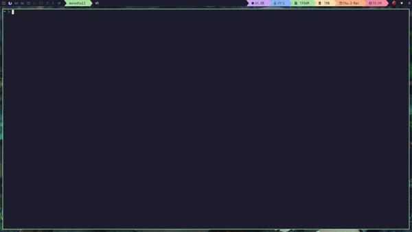

# Qtile Rice with the Arch Linux post install scripts



This simple post Arch base installation script was made primarily for myself,
because I'm usually too lazy to do this stuff manually all over again.
The neat thing when it comes to Linux is, if you know a bit of bash scripting or
a bit of Python, you'll never have to do things twice once you configure them the way you like.
You can automatize everything in a just few lines of code.

Script was also created for those who wanna start using window managers and wanna try them for the first time,
but don't know how or what they need to tweak, configure or install. 
The script installs and configures almost everything that you need to do after base installation of Arch Linux
with Yay AUR helper installed.

Qtile is completely written in Python and although Qtile it's not that popular when it comes to window managers
like i3, DWM, Awesome or BSPWM, at least from what I've seen on Reddits Unixporn, it's very easy to configure
because of that. Python is very popular and easy to understand and follow along language to understand.

One of the window managers that I haven't mention here is XMonad.
In my humble opinion, Qtile goes toe to toe with XMonad WM who is considered quite often the most customizable of them all.
Except, it's not written in Haskell, but Python.

Enjoy in one of the best and my personal favorite window managers.

#### Script installs a lot of stuff that you personally may not need, so be sure to check them out and comment then out, if you don't need them.

Some of the programs that come with this scripts are:

* `LXAppearance` Light-weight theme switcher from LXDE
* `PCManFM` Light-weight file manager from LXDE
* `nomacs` Free and open source image viewer
* `alacritty` A modern terminal emulator that comes with sensible defaults, but allows for 
extensive configuration NOTE: GPU BASED TERMINAL THAT CAN BE VERY FAST, BUT WON'T WORK ON 
OLDER GPU's - YOU NEED TO HAVE AT LEAST OpenGL 2.0 OR PREFERABLY HIGHER!
* `termite` An easy to use and easy to configure keyboard-centric VTE-based 
terminal(obsoleted by Alacritty)
* `st` or Simple Terminal - Light-weight terminal from Suckless guys. Default terminal in my rice of Qtile.
And the one that I use the most.
* `Comic Mono` font
* `Iosevka-Mayukai` font
* `Catppuccin` Mocha palette colors, that are used in this rice
* `zsh` ZSH shell with `OhMyZsh` and `p10k`
* `rofi` A window switcher, Application launcher and dmenu replacement that I use for power menu mostly
* `dmenu` another Suckless tool that I use as an app launcher
* `firefox` Web Browser
* `chromium` Web Browser
* `mpv` Best video player
* `LightDM` LightDM login manager
* `code` Visual Studio Code - A cross-platform text editor developed by Microsoft, built on the Electron framework


## Installation:

```
cd ~
```

```
git clone https://github.com:vecitipacijent/laptop.git
```

```
cd qtile
```

```
chmod +x install.sh
```

```
sh install.sh
```

## Enjoy!

